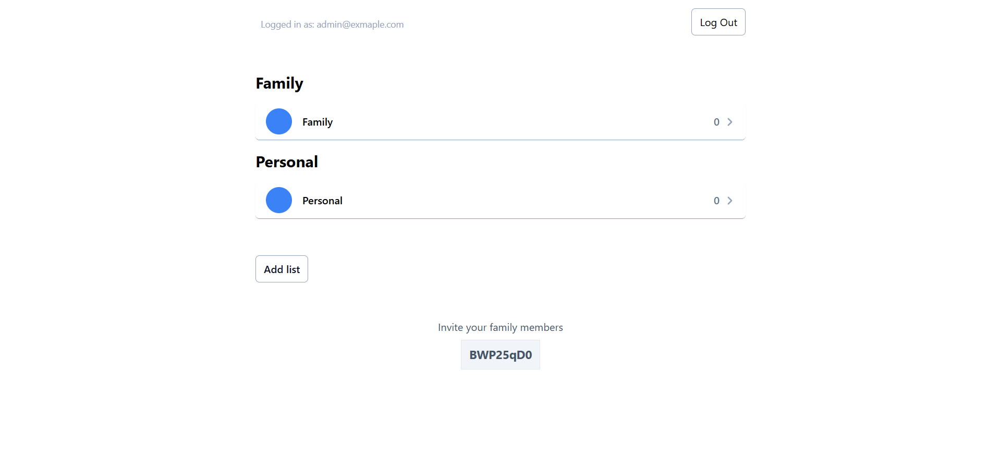

# Fridge


I created this project to demonstrate my coding style and some of the skills I've developed. My goal was to build something that touches on key aspects of full-stack development, like databases, frontend and backend, authentication, role-based systems, testing, CI/CD and more.

The project is a family reminders app, named **"Fridge"**, inspired by the sticky notes commonly found on a family kitchen fridge! 😁

I aimed to demonstrate the complete application lifecycle, focusing on the developer workflow — from coding to testing and deployment. The stack I chose reflects these aspects and showcases the technologies I am most comfortable with.


## Technology Stack and Features

- 🚀 [**FastAPI**](https://fastapi.tiangolo.com) for the Python backend API.
    - 🧰 [SQLModel](https://sqlmodel.tiangolo.com) for the Python SQL database interactions (ORM).
    - 🔍 [Pydantic](https://docs.pydantic.dev), used by FastAPI, for the data validation and settings management.
    - 💾 [PostgreSQL](https://www.postgresql.org) as the SQL database.
    - ✅ [Pytest](https://pytest.org), for backend testing.
- ⚛️ [React](https://react.dev) for the frontend.
    - ⚡ [Vite](https://vitejs.dev/), as the build tool.
    - 💻 [TypeScript](https://www.typescriptlang.org/), for type safety and improved developer experience.
    - 🎨 [Tailwind](https://tailwindcss.com) for the frontend components.
    - 🔄 [TanStack Query](https://tanstack.com/query/latest/docs/framework/react/overview) for client side data-fetching.
    - 📝 [TanStack Form](https://tanstack.com/form/latest/docs/overview), for handling forms.
    - 🧱 [Zod](https://zod.dev/), for user input validation.
    - 🧪 [Playwright](https://playwright.dev) for End-to-End testing.
    - 🤖 An automatically generated frontend client.
- 🐋 [Docker Compose](https://www.docker.com) for production.
- 🔒 Secure password hashing by default.
- 🔑 JWT (JSON Web Token) authentication.
- 🏭 CI (continuous integration) and CD (continuous deployment) based on GitHub Actions.

### Login

[](https://github.com/david-miklos/fridge)

### Sign Up

[](https://github.com/david-miklos/fridge)

### Setup

[](https://github.com/david-miklos/fridge)

### Home

[](https://github.com/david-miklos/fridge)

### Add List

[](https://github.com/david-miklos/fridge)

### Edit List

[](https://github.com/david-miklos/fridge)

### Add Task

[](https://github.com/david-miklos/fridge)

### Tasks

[](https://github.com/david-miklos/fridge)

### Interactive API Documentation

[](https://github.com/david-miklos/fridge)

## User Roles

**1. Family Admin**
- Can create a family.
- Can create and edit  a family list.
- Can promote a member to admin.
- Can assign tasks to specific members.

**2. Family Member**
- Can join a family.
- Can create and edit a personal list.
- Can create / complete / clear personal tasks.

## How to Use: Try It Out

### Requirements

* [Docker](https://www.docker.com/).

To spin up the stack run:

```bash
docker compose up -d --build
```

- Frontend: http://localhost

- Backend API docs: http://localhost:8000/docs

- Backend API Base URL: http://localhost:8000/api -> Health check: http://localhost:8000/api/ping/

## Development

For development, you need to start the development database. To do so, run the following script:

```bash
bash scripts/start-dev-db.sh
```

The script will spin up the Docker container for the development database and set it up using the `scripts/setup-db.sh` script in the `backend/` directory.

It will check if the development database is running, apply the necessary migrations, and initialize the database with the initial data.

### The .env file

The `.env` file is the one that contains all your configurations, generated keys and passwords, etc.

Depending on your workflow, you could want to exclude it from Git, for example if your project is public. In that case, you would have to make sure to set up a way for your CI tools to obtain it while building or deploying your project.

One way to do it could be to add each environment variable to your CI/CD system, and updating the `docker-compose.yml` file to read that specific env var instead of reading the `.env` file.

### Pre-commits and code linting

we are using a tool called [pre-commit](https://pre-commit.com/) for code linting and formatting.

When you install it, it runs right before making a commit in git. This way it ensures that the code is consistent and formatted even before it is committed.

You can find a file `.pre-commit-config.yaml` with configurations at the root of the project.

#### Install pre-commit to run automatically

`pre-commit` is already part of the dependencies of the project, but you could also install it globally if you prefer to, following [the official pre-commit docs](https://pre-commit.com/).

After having the `pre-commit` tool installed and available, you need to "install" it in the local repository, so that it runs automatically before each commit.

Using `poetry`, you could do it with:

```bash
❯ poetry run pre-commit install
pre-commit installed at .git/hooks/pre-commit
```


#### Running pre-commit hooks manually

you can also run `pre-commit` manually on all the files, you can do it using `poetry` with:

```bash
❯ poetry run pre-commit run --all-files
check for added large files..............................................Passed
check toml...............................................................Passed
check yaml...............................................................Passed
ruff.....................................................................Passed
ruff-format..............................................................Passed
eslint...................................................................Passed
prettier.................................................................Passed
```


### Migrations

You can run the migrations with `alembic`.

Make sure you create a `"revision"` of your models and that you `"upgrade"` your database with that revision every time you change them. As this is what will update the tables in your database. Otherwise, your application will have errors.

Alembic is already configured to import your SQLModel models from ./backend/app/models.py.

After changing a model (for example, adding a column), create a revision, e.g.:

```bash
alembic revision --autogenerate -m "Add column last_name to User model"
```

Commit to the git repository the files generated in the alembic directory.

After creating the revision, run the migration in the database (this is what will actually change the database):

```bash
alembic upgrade head
```

### Backend testing

To test the backend run:

```bash
poetry run bash scripts/test.sh
```

The tests run with Pytest, modify and add tests to `backend/tests/`.


Backend docs: [backend/README.md](./backend/README.md).

